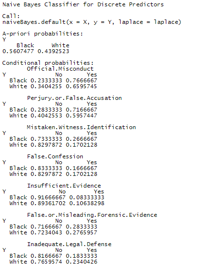

```{r setup, include=FALSE}
knitr::opts_chunk$set(cache = TRUE, echo = FALSE, message = FALSE, warning = FALSE)
```

```{r}
# Carico le librerie
library(readr)
library(ggplot2)
library(gridExtra) # organizza grafici basati su griglia 
library(glue)      # incolla stringhe ai dati 
library(tidyverse)
library(tidyr)
library(dplyr)
library(leaflet)   # crea mappe interattive
library(plotly)    # rende interattivi i grafici
library(scales)    # per percentuali
```

## Introduzione - Diritti inalienabili

<blockquote>

<p>«Noi riteniamo che sono per se stesse evidenti queste verità: che tutti gli uomini sono creati eguali; che essi sono dal Creatore dotati di certi inalienabili diritti, che tra questi diritti sono la **Vita**, la **Libertà**, e il **perseguimento della Felicità**.»</p>

<cite>Dichiarazione d'Indipendenza degli Stati Uniti d'America</cite>

</blockquote>


## Introduzione - Pena capitale

La **pena di morte** è ancora in vigore in ben **27 Stati** degli Stati Uniti d'America, 5 dei quali hanno aderito a moratorie, gli altri 23 invece hanno deciso di abolirla nel corso degli anni.

[Death Penalty Information Center](https://deathpenaltyinfo.org/) è un'organizzazione senza scopo di lucro che fornisce informazioni sulla pena capitale e sul braccio della morte negli USA.

```{r}
mapStates = read.csv("Deathpenaltystates.csv") # contenente le coordinate dei vari stati

mapdata = map_data("state") 

# Combino i due dataframe
mapdata <- left_join(mapdata, mapStates, by="region")

code <- mapdata$code
year <- mapdata$Year
year <- ifelse(!is.na(year), year, "")

label <- glue('{code} ','{year} ') # etichette con codice univoco Stato e anno abolizione pena di morte

map <- ggplot(mapdata, aes(x=long, y=lat, group=group)) +
  geom_polygon(aes(fill = as.numeric(as.factor(Deathpenalty))), color="white") +
  scale_fill_gradientn(breaks = c(1,2,3), colours = c("blue", "green", "red"),
                       labels = c("Moratoria", "Assente", "Presente"))+
  theme(axis.text.x = element_blank(),
        axis.text.y = element_blank(),
        axis.ticks = element_blank(),
        axis.title.x = element_blank(),
        axis.title.y = element_blank(),
        rect = element_blank(),
        plot.title = element_text(
          size = rel(1.2), lineheight = .9, family = "NimbusSan",
          face = "bold", colour = "#797979")) +
  labs(title = "La pena di morte in vigore negli USA", fill = "Pena di morte") +
  guides(colour=guide_legend(
    nrow = 3,
    title.position = "top",
    title.hjust = 0.5
  ))+
  geom_text(aes(x = Longitude, y = Latitude, label = label), size = 2.5)

map
```

## Problema

L'analisi svolta verte sulla pena di morte, in particolare tratta:

-   il **numero di decessi** dovuto ad essa nei diversi Stati;

-   gli **anni** in cui si è verificata maggiormente;

-   l'incidenza del **genere**;

-   **razzismo** ed esecuzioni;

-   la **giustizia**: tra innocenza e colpevolezza;

-   la relazione tra **criminalità** e pena capitale.

## Le vittime

L'analisi confronta il numero di vittime e il tasso di esecuzioni ogni 100000 residenti nei diversi Stati nel periodo 1976-2021.

```{r}
execution <- read.csv("DPIC Execution Database - U.S. Executions.csv")
execution <- execution %>%
  separate(Execution.Date, into = c("Month", "Day", "Year"), sep = "/") %>% # separo gli anni
  select(State,Race,Year) %>%
  filter(State != "Federal") %>%
  filter(Year != "2022") %>%
  filter(Year != "2023")

executionTexas <- execution %>%
  select(State,Race,Year) %>%
  filter(State == "Texas") %>%
  filter(Year != "2022") %>%
  filter(Year != "2023")

numberTexas <- nrow(executionTexas) # numero totale di esecuzioni in Texas

plot1 <- ggplot(data = execution, aes(fill = ifelse(State == "Arizona" | State == "Connecticut", "C", ifelse(State == "Texas", "A", "B")))) +
  geom_bar(mapping = aes(y = fct_infreq(State)), show.legend = FALSE) +
  scale_fill_manual(values = c(A = "red", B = "#797979", C = "green")) +
  geom_segment(aes(x = 510, y = 4.2, xend = 560, yend = 2.1, colour = "red"), size = 1.5, arrow = arrow(length = unit(0.02, "npc")), show.legend = FALSE) +
  geom_text(aes(x = 510, y = 4.6, label = numberTexas), color = "red") +
  xlab("Number of Executions") +
  ylab("State")

density <- read.csv("Density.csv") 

density <- density %>%
  filter(Victims != "0") %>%
  mutate(mean = rowMeans(density[1:34,5:50])) %>% # media popolazione 1976-2021
#  mutate(density = mean/LandArea) %>%  # popolazione al km^2
  mutate(percentage = (Victims/mean)*100000) # esecuzioni ogni 100000 residenti

plot2 <- ggplot(data = density, aes(x = percentage, y = reorder(State, -percentage), fill = ifelse(State == "Arizona" | State == "Connecticut", "C", ifelse(State == "Oklahoma", "A", "B")))) +
  scale_fill_manual(values = c(A = "red", C = "green"), labels = c("Peak", "Stationary Positions")) +
  theme(
    legend.title = element_blank(),
    legend.position = "none"
  ) +
  geom_col() +
  xlab("Executions (per 100000 residents)") +
  ylab("State")

extract_legend <- function(my_ggp){
  step1 <- ggplot_gtable(ggplot_build(my_ggp))
  step2 <- which(sapply(step1$grobs, function(x) x$name) == "guide-box")
  step3 <- step1$grobs[[step2]]
  return(step3)
}

legend_2 <- plot2 +
  theme(legend.position = "bottom")

shared_legend_2 <- extract_legend(legend_2)

grid.arrange(arrangeGrob(plot1, plot2, ncol = 2), shared_legend_2, nrow = 2, heights = c(10,1))
```

Interessante notare come entrambi gli Stati con il maggior numero di esecuzioni assoluto e relativo si trovino nel Sud degli USA:

```{r}
map <- leaflet() %>% # mappa
  addTiles() %>%
  setView(lng = -97.336201, lat = 33.891845, zoom = 4.6) %>%
  addMarkers(lng = -98.927534, lat = 31.120919, label = "Texas") %>%
  addMarkers(lng = -97.084627, lat = 35.271362, label = "Oklahoma")

map
```

## La pena capitale negli anni

Analizzando il numero di vittime dovute alla pena capitale nel periodo 1976-2022, si nota un picco nel 1999.

```{r}
execution <- read.csv("DPIC Execution Database - U.S. Executions.csv")
execution <- execution %>%
  separate(Execution.Date, into = c("Month", "Day", "Year"), sep = "/") %>% # separo gli anni
  filter(State != "Federal") %>%
  filter(Year != "2023") %>%
  count(Year)

plot <- plot_ly(execution, x = ~Year, y = ~n, type = 'bar', name = 'Year', marker = list(color = ifelse(execution$Year=="1999",'rgb(230,105,109)','rgb(49,130,189)')), text = ~paste("Year: ", Year, '<br>Executions:', n), textposition='none') 
plot <- plot %>% layout(xaxis = list(title = "Year", tickangle = -60),
                        yaxis = list(title = "Number of Executions"),
                        margin = list(b = 100),
                        barmode = 'group')

plot
```

## L'incidenza del genere

Una delle domande a cui la ricerca vuole rispondere è se il genere dei detenuti influisca sulla pena capitale:

```{r}
execution <- read.csv("DPIC Execution Database - U.S. Executions.csv")

execution <- execution %>%
  separate(Execution.Date, into = c("Month", "Day", "Year"), sep = "/") %>%  #separo gli anni
  group_by(Sex, Year) %>%
  summarise(count=n()) %>%
  select(count, Year, Sex)

execution$Year <- as.numeric(execution$Year)

executions <- ggplot(data = execution, mapping=aes(x=Year, y=count, color = Sex))+
  geom_point() +
  geom_smooth(se=FALSE) +
  scale_x_continuous(limits=c(1976,2023)) +
  xlab("Year") +
  ylab("Number of Executions")

executions
```

Si può notare una notevole differenza tra uomini e donne: infatti, gli uomini vengono giustiziati in modo notevolmente maggiore raggiungendo un picco nel 1999, anno in cui si registra il massimo numero di esecuzioni.

Di seguito viene rappresentata la distribuzione:

```{r}
execution <- read.csv("DPIC Execution Database - U.S. Executions.csv")

execution <- execution %>%
  separate(Execution.Date, into = c("Month", "Day", "Year"), sep = "/") %>%  #separo gli anni
  group_by(Sex) %>%
  summarise(count=n(), Sex)

class.dist = table(execution$Sex)
barplot(class.dist, legend.text = class.dist, col=ifelse(class.dist == "18", '#f8766d', '#00bfc4') )
```

## Razzismo ed esecuzioni

I recenti episodi di cronaca e le forti disuguaglianze sociali hanno posto in luce una possibile relazione tra elementi di razzismo e il numero di esecuzioni nel corso degli anni. La ricerca dimostra che:

```{r}
execution <- read.csv("DPIC Execution Database - U.S. Executions.csv")

execution <- execution %>%
  separate(Execution.Date, into = c("Month", "Day", "Year"), sep = "/") %>%  #separo gli anni
  group_by(Race, Year) %>%
  filter(Race=="Black" || Race=="White" || Race=="Latinx") %>%
  summarise(count=n()) %>%
  select(count,Year, Race)

execution$Year <- as.numeric(execution$Year)

executions <- ggplot(data = execution, mapping=aes(x=Year, y=count, color = Race))+
  geom_point() +
  geom_smooth(se=FALSE) +
  scale_x_continuous(limits=c(1976,2023))+
  labs(x="Year", y="Number of Executions")

executions
```

Si visualizza la relazione tra la questione razziale e le regioni degli USA:

```{r}
execution <- read.csv("DPIC Execution Database - U.S. Executions.csv")

execution <- execution %>%
  group_by(Race, Region) %>%
  filter(Race=="Black" || Race=="White" || Race=="Latinx") %>%
  summarise(count=n(), Race, Region)

execution <- execution
execution <- execution %>% count(Region, Race)
plot <- execution %>% plot_ly(x = ~Region, y = ~n, color=ifelse(execution$Race=="White", "#f8766d", ifelse(execution$Race=="Black", "#639dff","#00ba38")), name=ifelse(execution$Race=="White", "3 - White", ifelse(execution$Race=="Black", "2 - Black","1 - Latinx")))
plot <- plot %>% layout(xaxis = list(title = "Region"),
                        yaxis = list(title = "Number of Executions"),
                        margin = list(b = 100),
                        barmode = 'group')

plot
```

Si nota in particolare che il divario tra il numero di esecuzioni di persone bianche e di colore si riduce notevolmente nella regione del Sud.

## Innocenza o colpevolezza?

### Razzismo ed anni nel braccio della morte

Gli innocenti che passano più anni nel braccio della morte prima di essere scarcerati sono in ordine decrescente: afroamericani, latini e bianchi.

```{r}
innocence <- read.csv("Innocence Database.csv")

innocence <- innocence %>%
  filter(Race == "Latinx" | Race == "Black" | Race == "White") %>%
  select(Years.Between, Race)

innocence %>%
  ggplot(aes(x=reorder(Race, Years.Between, FUN=median), Years.Between))+
  geom_boxplot(aes(fill=Race))+
  labs(x="Race", y="Years in the Death Row")

```

## Innocenza o colpevolezza?

### Stati e anni nel braccio della morte

```{r}
innocence <- read.csv("Innocence Database.csv")

innocence <- innocence %>%
  filter(Race == "Latinx" | Race == "Black" | Race == "White") %>%
  select(Years.Between, State)

plot <- plot_ly(innocence, x = reorder(innocence$State, innocence$Years.Between, FUN=median), y = ~Years.Between, type = 'box', name = ~State, color = ~State) 
plot <- plot %>% layout(xaxis = list(title = "State", tickangle = -60),
                        yaxis = list(title = "Years in the Death Row"),
                        margin = list(b = 100),
                        barmode = 'group')

plot
```

<p>

</p>


Analisi dei primi 5 stati con mediana degli anni nel braccio della morte maggiore:

| Stati         | Regione   | Pena capitale | Anno abolizione | Scarcerazioni      | Mediana | Casi divisi per etnia |
|---------------|-----------|---------------|-----------------|--------------------|---------|-----------------------|
| Massachussets | NorthEast | No            | 1984            | 3                  | 30      | Black: 2 - White: 1   |
| Maryland      | South     | No            | 2013            | 2                  | 25.5    | White: 2              |
| Nevada        | West      | Sì            | ---             | 2                  | 24      | Black: 1 - Latinx: 1  |
| Ohio          | MidWest   | Sì            | ---             | 11                 | 23      | Black: 8 - White: 3   |
| Mississippi   | South     | Sì            | ---             | 7                  | 21      | Black: 6 - White: 1   |

### Clustering: K-Means

```{r}
innexectot <- read.csv("innocenceandexecutionsbyrace.csv")
rownames(innexectot) <- innexectot$State
innexec <- subset(innexectot, select=-c(State))
df <- scale(innexec) # Scaling the data

# Compute k-means with k = 7
set.seed(123)
km.res <- kmeans(df, 7, nstart = 25)

# Print the results
#print(km.res)

# Compute the mean for each cluster for each attribute
#aggregate(innexec, by=list(cluster=km.res$cluster), mean)

# Add the cluster column
#dd <- cbind(innexec, cluster = km.res$cluster)

```

 

## Innocenza o colpevolezza?

### Motivi di incarcerazione

L'analisi si concentra dunque sui motivi dell'incarcerazione considerando come primo elemento il ruolo del DNA.

```{r}
innocence <- read.csv("Innocence Database.csv")

innocence <- innocence %>%
  count(DNA) %>%
  group_by(DNA, n)

fig <- plot_ly(innocence, labels = ~DNA, values = ~n, type = 'pie',
        textposition = 'inside',
        textinfo = 'label+percent',
        insidetextfont = list(color = '#FFFFFF'),
        hoverinfo = 'text',
        marker = list(colors = ~DNA,
                      line = list(color = '#FFFFFF', width = 1)),
        showlegend = FALSE)
fig <- fig %>% layout(title = 'DNA',
         xaxis = list(showgrid = FALSE, zeroline = FALSE, showticklabels = FALSE),
         yaxis = list(showgrid = FALSE, zeroline = FALSE, showticklabels = FALSE))

fig
```

Sono stati quindi analizzati i motivi delle errate incarcerazioni per verificare l'incidenza del razzismo su di esse.

```{r}
innocence <- read.csv("Innocence Database.csv")

innocence1 <- innocence %>%
  count(Mistaken.Witness.Identification, Race) %>%
  mutate(yn = Mistaken.Witness.Identification) %>%
  mutate(Mistaken.Witness.Identification = n) %>%
  group_by(Mistaken.Witness.Identification) %>%
  summarise(Mistaken.Witness.Identification, yn, Race) %>%
  filter(yn=="Yes") %>%
  filter(Race=="Black" | Race=="White" | Race=="Latinx")

innocence2 <- innocence %>%
  count(False.Confession, Race) %>%
  mutate(yn = False.Confession) %>%
  mutate(False.Confession = n) %>%
  group_by(False.Confession) %>%
  summarise(False.Confession, yn, Race) %>%
  filter(yn=="Yes") %>%
  filter(Race=="Black" | Race=="White" | Race=="Latinx")

innocence8 <- merge(innocence1, innocence2) #merge

innocence3 <- innocence %>%
  count(Insufficient.Evidence, Race) %>%
  mutate(yn = Insufficient.Evidence) %>%
  mutate(Insufficient.Evidence = n) %>%
  group_by(Insufficient.Evidence) %>%
  summarise(Insufficient.Evidence, yn, Race) %>%
  filter(yn=="Yes") %>%
  filter(Race=="Black" | Race=="White" | Race=="Latinx")

innocence9 <- merge(innocence8, innocence3) #merge 

innocence4 <- innocence %>%
  count(Official.Misconduct, Race) %>%
  mutate(yn = Official.Misconduct) %>%
  mutate(Official.Misconduct = n) %>%
  group_by(Official.Misconduct) %>%
  summarise(Official.Misconduct, yn, Race) %>%
  filter(yn=="Yes") %>%
  filter(Race=="Black" | Race=="White" | Race=="Latinx")

innocence10 <- merge(innocence9, innocence4) #merge 

innocence5 <- innocence %>%
  count(Perjury.or.False.Accusation, Race) %>%
  mutate(yn = Perjury.or.False.Accusation) %>%
  mutate(Perjury.or.False.Accusation = n) %>%
  group_by(Perjury.or.False.Accusation) %>%
  summarise(Perjury.or.False.Accusation, yn, Race) %>%
  filter(yn=="Yes") %>%
  filter(Race=="Black" | Race=="White" | Race=="Latinx")

innocence11 <- merge(innocence10, innocence5) #merge 

innocence6 <- innocence %>%
  count(False.or.Misleading.Forensic.Evidence, Race) %>%
  mutate(yn = False.or.Misleading.Forensic.Evidence) %>%
  mutate(False.or.Misleading.Forensic.Evidence = n) %>%
  group_by(False.or.Misleading.Forensic.Evidence) %>%
  summarise(False.or.Misleading.Forensic.Evidence, yn, Race) %>%
  filter(yn=="Yes") %>%
  filter(Race=="Black" | Race=="White" | Race=="Latinx")

innocence12 <- merge(innocence11, innocence6) #merge 

innocence7 <- innocence %>%
  count(Inadequate.Legal.Defense, Race) %>%
  mutate(yn = Inadequate.Legal.Defense) %>%
  mutate(Inadequate.Legal.Defense = n) %>%
  group_by(Inadequate.Legal.Defense) %>%
  summarise(Inadequate.Legal.Defense, yn, Race) %>%
  filter(yn=="Yes") %>%
  filter(Race=="Black" | Race=="White" | Race=="Latinx")

innocencetot <- merge(innocence12, innocence7) #merge 

# sistemo il dataset per realizzare al meglio il grafico
x <- c("Mistaken.Witness.Identification", "False.Confession", "Insufficient.Evidence","Official.Misconduct", "Perjury.or.False.Accusation", "False.or.Misleading.Forensic.Evidence", "Inadequate.Legal.Defense")
B <- c(innocencetot[1,3], innocencetot[1,4], innocencetot[1,5], innocencetot[1,6], innocencetot[1,7], innocencetot[1,8], innocencetot[1,9])  # Black
L <- c(innocencetot[2,3], innocencetot[2,4], innocencetot[2,5], innocencetot[2,6], innocencetot[2,7], innocencetot[2,8], innocencetot[2,9])  # Latinx
W <- c(innocencetot[3,3], innocencetot[3,4], innocencetot[3,5], innocencetot[3,6], innocencetot[3,7], innocencetot[3,8], innocencetot[3,9])  # White
data <- data.frame(x, B, L, W)

fig <- plot_ly(data, x = reorder(data$x, data$B), y = ~B, type = 'bar', name = 'Black', marker=list(color = '#f8766d'))
fig <- fig %>% add_trace(y = ~W, name = 'White', marker=list(color = '#639dff'))
fig <- fig %>% add_trace(y = ~L, name = 'Latinx', marker=list(color = '#00ba38'))

fig <- fig %>% layout(xaxis = list(title = "Reasons", tickangle = -15),
                        yaxis = list(title = "Number of Exonerations"),
                        margin = list(b = 100),
                        barmode = 'group')


fig
```

```{r}
#Modello predittivo: Decision Tree

innocence <- read.csv("Innocence Database.csv")

innocence <- innocence %>%
  filter(Race == "Black" | Race == "White")

df2 = subset(innocence, select = c(Official.Misconduct, Perjury.or.False.Accusation, Mistaken.Witness.Identification, False.Confession, Insufficient.Evidence, False.or.Misleading.Forensic.Evidence, Inadequate.Legal.Defense, Race))

colnames(df2)[colnames(df2)=="Perjury.or.False.Accusation"] <- "P.F.A."
colnames(df2)[colnames(df2)=="Official.Misconduct"] <- "O.M."
colnames(df2)[colnames(df2)=="Mistaken.Witness.Identification"] <- "M.W.I"
colnames(df2)[colnames(df2)=="False.Confession"] <- "F.C."
colnames(df2)[colnames(df2)=="Insufficient.Evidence"] <- "I.E."
colnames(df2)[colnames(df2)=="False.or.Misleading.Forensic.Evidence"] <- "F.M.F.E."
colnames(df2)[colnames(df2)=="Inadequate.Legal.Defense"] <- "I.L.D."

library(caTools)

#make this example reproducible
set.seed(17)

#use 70% of dataset as training set and 30% as test set
split <- sample.split(df2, SplitRatio = 0.7)
train_cl <- subset(df2, split == "TRUE")
test_cl <- subset(df2, split == "FALSE")

library(rpart)
library(cluster)
library(maptree)

# creation of an object 'model' using rpart function
decision.tree = rpart(Race ~ ., data = train_cl, method = 'class')
#draw.tree(decision.tree, cex=1)

library(lattice)
library(caret)

dt_pred <- predict(decision.tree, test_cl, type = "class")

# Confusion Matrix
dt_cm <- table(test_cl$Race, dt_pred)
#dt_cm

# Model Evaluation
#confusionMatrix(dt_cm, positive = "Black")
```

Modello predittivo: Naive Bayes

```{r}
innocence <- read.csv("Innocence Database.csv")

innocence <- innocence %>%
  filter(Race == "Black" | Race == "White")

df2 = subset(innocence, select = c(Official.Misconduct, Perjury.or.False.Accusation, Mistaken.Witness.Identification, False.Confession, Insufficient.Evidence, False.or.Misleading.Forensic.Evidence, Inadequate.Legal.Defense, Race))

library(caTools)

#make this example reproducible
set.seed(17)

#use 70% of dataset as training set and 30% as test set
split <- sample.split(df2, SplitRatio = 0.7)
train_cl <- subset(df2, split == "TRUE")
test_cl <- subset(df2, split == "FALSE")

# Naive Bayes
library(e1071)
library(caret)

nb <- naiveBayes(Race ~ ., data = train_cl)
#nb

# Predicting on test data
nb_pred <- predict(nb, newdata = test_cl)

# Confusion Matrix
nb_cm <- table(test_cl$Race, nb_pred)
#nb_cm

# Model Evaluation
#confusionMatrix(nb_cm, positive = "Black")

```

 


## Deterrenza

La pena di morte funge da deterrente?

```{r}
murderrates <- read.csv("Murder rates.csv")

rates <- plot_ly(murderrates, x = ~Year, y = ~Murder.Rate.in.Death.Penalty.States, type = 'bar', name = 'Death Penalty', marker=list(color = '#f8766d'), text = ~paste("Percent difference: ", murderrates$Percentage.difference), textposition='none')
rates <- rates %>% add_trace(y = ~Murder.Rate.in.Nondeath.Penalty.States, name = 'Non-death Penalty', marker=list(color = '#00ba38'))

rates <- rates %>% layout(xaxis = list(title = "Year", tickangle = -15),
                         yaxis = list(title = "Murder Rate (per 100000)"),
                         margin = list(b = 100),
                         barmode = 'group')

rates
```

<p>

</p>

Il **tasso di omicidi** negli Stati in cui viene applicata la pena di morte è sempre risultato **maggiore** rispetto a quello degli Stati in cui non è presente.

Nel periodo considerato, il maggiore divario risulta nel 2007 (47%).

## Conclusioni

-   Gli Stati con il maggior numero di esecuzioni si trovano nella regione del Sud degli USA (Texas, Oklahoma)

-   Nel 1999 si registra il picco di esecuzioni

-   Gli uomini vengono giustiziati in numero notevolmente maggiore rispetto alle donne

-   La questione razziale è intrinseca alle esecuzioni in quanto:

    -   nonostante i bianchi vengano giustiziati in maggior numero, il divario di esecuzioni con la popolazione di colore è molto minore nel Sud degli USA, dove avvengono più esecuzioni;

    -   le persone latine e di colore non colpevoli passano più anni nel braccio della morte;
    
    <p>
    
    </p>

    -   le persone di colore vengono incriminate maggiormente pur essendo innocenti e ciò a causa di: falsa testimonianza (18), difesa legale inadeguata (26), errore nell'identificazione da parte di un testimone (27), prove forensi false o fuorvianti (30), spergiuro o falsa accusa (73) e cattiva condotta ufficiale (81).

-   La pena capitale non funge da deterrente in quanto gli Stati che la applicano hanno anche un tasso più alto di omicidi

## Sitografia

Si riportano i link dei dataset scaricati e dei siti consultati per effettuare le diverse analisi:

-   <https://deathpenaltyinfo.org/database/executions>

-   <https://deathpenaltyinfo.org/database/innocence>

-   <https://deathpenaltyinfo.org/facts-and-research/murder-rates/murder-rate-of-death-penalty-states-compared-to-non-death-penalty-states>

-   <https://deathpenaltyinfo.org/state-and-federal-info/state-by-state>

-   <https://it.wikipedia.org/wiki/Stati_degli_Stati_Uniti_d%27America_per_superficie>

-   <https://datacommons.org/place?hl=it>
